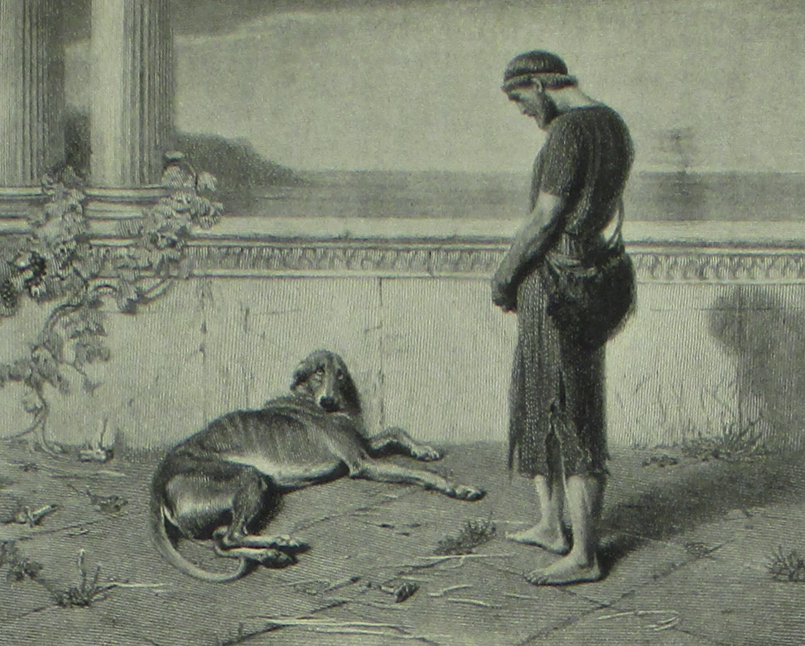

# argosrc

<!-- badges: start -->

<!-- badges: end -->

argosrc is an odytools companion package designed to evaluate a REDCap database for completeness and plausibility issues.

Argos was Odysseus's dog. Even though he was old and ill, he recognized Odysseus when he returned to Ithaca after 20 years of absence. He then died.



## Installation

You can install argosrc from [GitHub](https://github.com/) with:

``` r
# install.packages("pak")
pak::pak("VHIO-Odyssey/argosrc")
```
